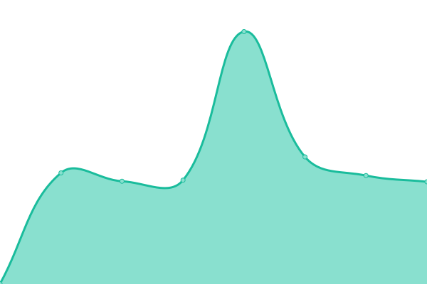

# [📈 Live Status](https://demo.upptime.js.org): <!--live status--> **🟧 Partial outage**

This repository contains the open-source uptime monitor and status page for [Upptime](https://upptime.js.org), powered by [Upptime](https://github.com/upptime/upptime).

With [Upptime](https://upptime.js.org), you can get your own unlimited and free uptime monitor and status page, powered entirely by a GitHub repository. We use [Issues](https://github.com/upptime/upptime/issues) as incident reports, [Actions](https://github.com/nib216/upptime/actions) as uptime monitors, and [Pages](https://demo.upptime.js.org) for the status page.

<!--start: status pages-->
<!-- This summary is generated by Upptime (https://github.com/upptime/upptime) -->
<!-- Do not edit this manually, your changes will be overwritten -->
<!-- prettier-ignore -->
| URL | Status | History | Response Time | Uptime |
| --- | ------ | ------- | ------------- | ------ |
|  Manager | 🟥 Down | [manager.yml](https://github.com/cartelmatic/upptime/commits/HEAD/history/manager.yml) | 

 815ms
     
 | 

<a href="https://cartelmatic.github.io/upptime/history/manager">99.42%</a>
    

|  [Admin Baliz](https://admin-baliz.cartelmatic.com/) | 🟥 Down | [admin-baliz.yml](https://github.com/cartelmatic/upptime/commits/HEAD/history/admin-baliz.yml) | 

 766ms
     
 | 

<a href="https://cartelmatic.github.io/upptime/history/admin-baliz">99.37%</a>
    

|  [API](https://api.cartelmatic.com/APIDisponibilites/) | 🟥 Down | [api.yml](https://github.com/cartelmatic/upptime/commits/HEAD/history/api.yml) | 

 758ms
     
 | 

<a href="https://cartelmatic.github.io/upptime/history/api">99.37%</a>
    

|  [API Auth](https://api-auth.cartelmatic.com/docs) | 🟥 Down | [api-auth.yml](https://github.com/cartelmatic/upptime/commits/HEAD/history/api-auth.yml) | 

 916ms
     
 | 

<a href="https://cartelmatic.github.io/upptime/history/api-auth">99.37%</a>
    

|  [Back Office](https://bo.cartelmatic.com/) | 🟥 Down | [back-office.yml](https://github.com/cartelmatic/upptime/commits/HEAD/history/back-office.yml) | 

 732ms
     
 | 

<a href="https://cartelmatic.github.io/upptime/history/back-office">99.46%</a>
    

|  [Baliz](https://baliz.cartelmatic.com/) | 🟥 Down | [baliz.yml](https://github.com/cartelmatic/upptime/commits/HEAD/history/baliz.yml) | 

 631ms
     
 | 

<a href="https://cartelmatic.github.io/upptime/history/baliz">99.46%</a>
    

|  [Data Manager](https://data-manager.cartelmatic.com/) | 🟥 Down | [data-manager.yml](https://github.com/cartelmatic/upptime/commits/HEAD/history/data-manager.yml) | 

 625ms
     
 | 

<a href="https://cartelmatic.github.io/upptime/history/data-manager">99.47%</a>
    

|  [Funbox](https://funbox.cartelmatic.com/) | 🟥 Down | [funbox.yml](https://github.com/cartelmatic/upptime/commits/HEAD/history/funbox.yml) | 

 650ms
     
 | 

<a href="https://cartelmatic.github.io/upptime/history/funbox">99.35%</a>
    

|  [Site Web](https://www.cartelmatic.com/) | 🟩 Up | [site-web.yml](https://github.com/cartelmatic/upptime/commits/HEAD/history/site-web.yml) | 

 865ms
     
 | 

<a href="https://cartelmatic.github.io/upptime/history/site-web">100.00%</a>
    

|  [V4](https://v4.cartelmatic.com/ABRN01COS001FR31000/Client/index.php) | 🟥 Down | [v4.yml](https://github.com/cartelmatic/upptime/commits/HEAD/history/v4.yml) | 

 758ms
     
 | 

<a href="https://cartelmatic.github.io/upptime/history/v4">99.35%</a>
    

|  [Viewer](https://viewer.cartelmatic.com/) | 🟥 Down | [viewer.yml](https://github.com/cartelmatic/upptime/commits/HEAD/history/viewer.yml) | 

 582ms
     
 | 

<a href="https://cartelmatic.github.io/upptime/history/viewer">99.35%</a>
    

|  [VNC](https://vnc.cartelmatic.com/) | 🟥 Down | [vnc.yml](https://github.com/cartelmatic/upptime/commits/HEAD/history/vnc.yml) | 

 581ms
     
 | 

<a href="https://cartelmatic.github.io/upptime/history/vnc">99.40%</a>
    

<!--end: status pages-->

[**Visit our status website →**](https://demo.upptime.js.org)

## 📄 License

- Powered by: [Upptime](https://github.com/upptime/upptime)
- Code: [MIT](./LICENSE) © [Upptime](https://upptime.js.org)
- Data in the `./history` directory: [Open Database License](https://opendatacommons.org/licenses/odbl/1-0/)
